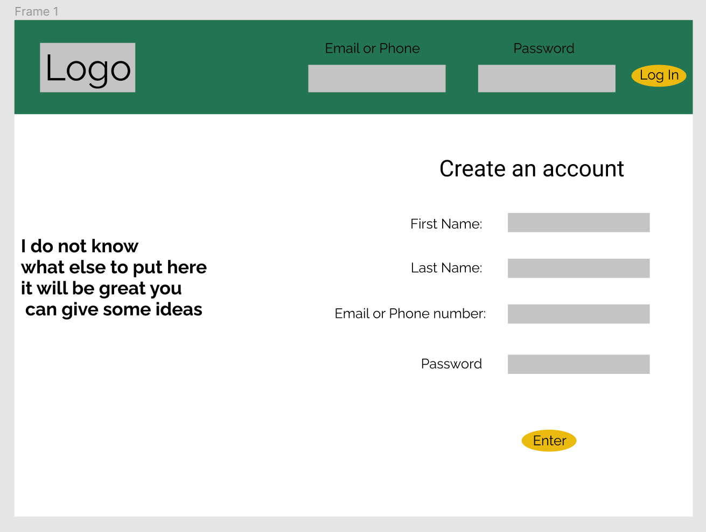
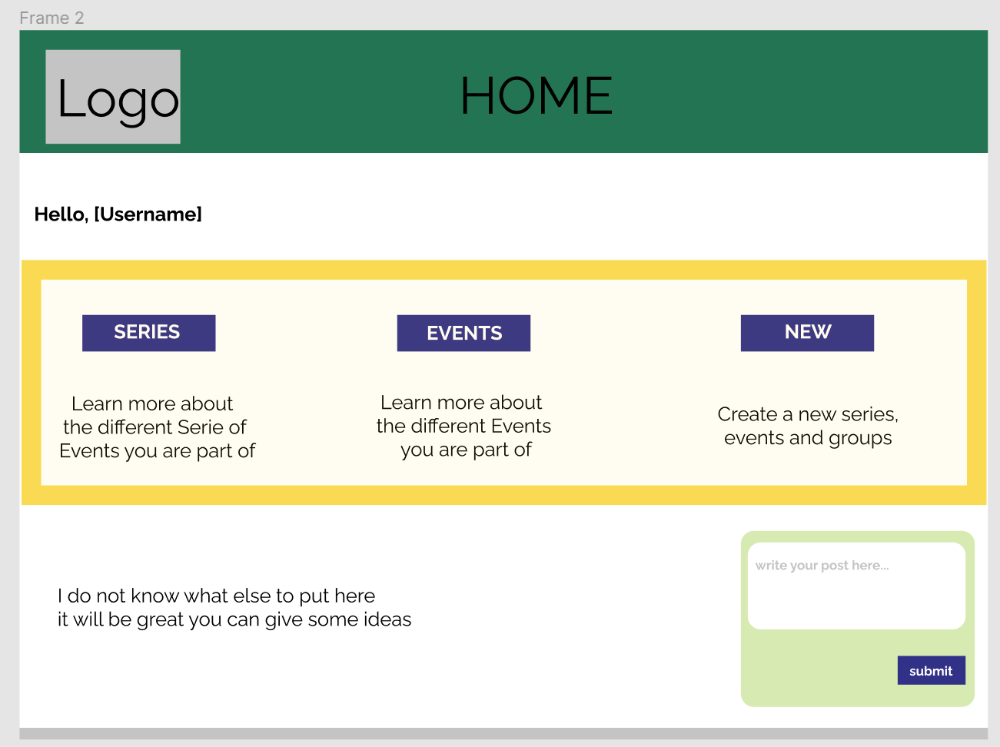
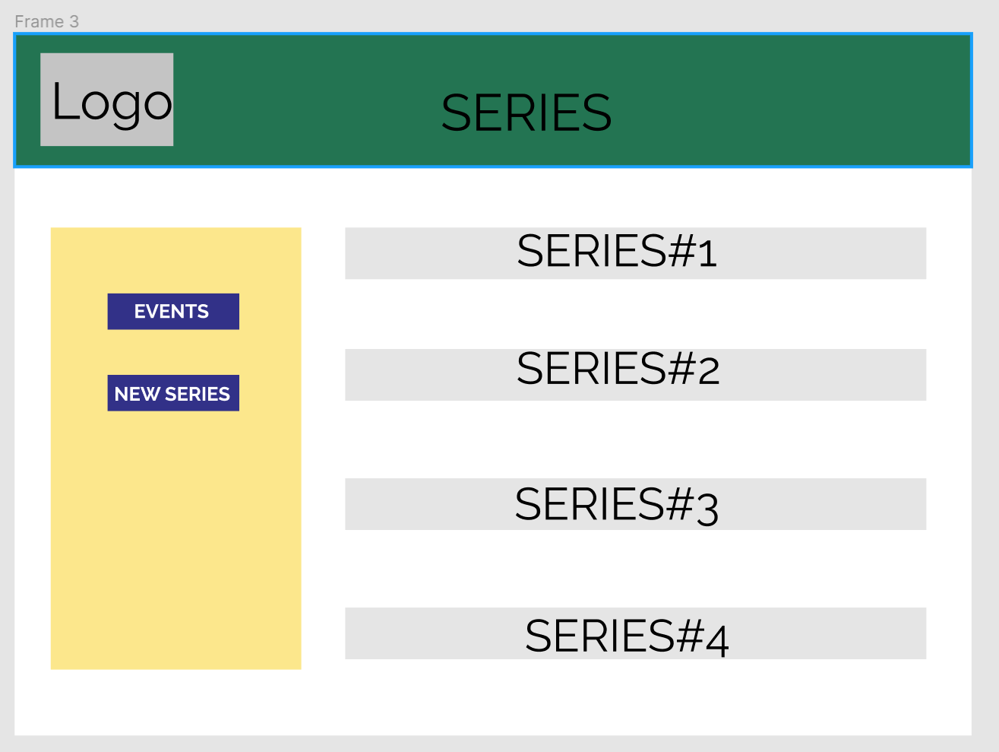
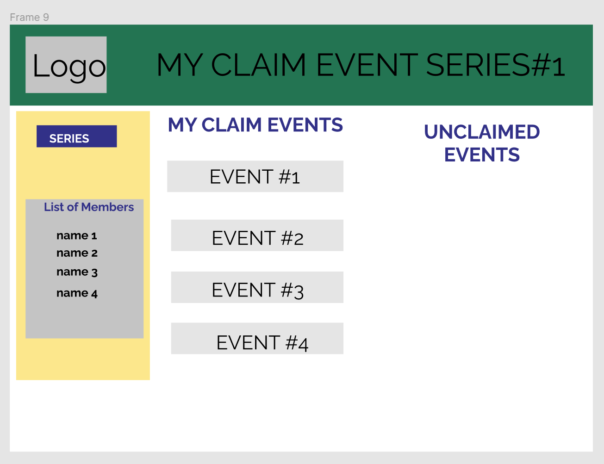
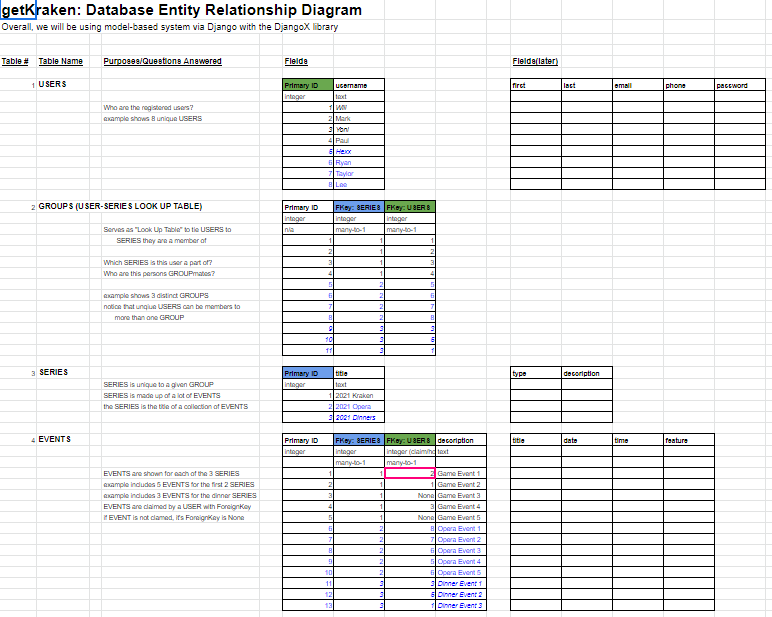

# getKraken
Given a group of sports fans all go in to buy season tickets to the Seattle Krakens, Get Kraken provides a fair way to allow individual members of that group to select which games they will get tickets to.

getKraken offers a fullstack python application with React front end and a docker/django back and middle stacks.

## Team Members

Paul Leonard

Mark Bell

Will Ulrich Motchoffo

Yonatan Palagashvili

## WireFrames

## User Stories

https://trello.com/b/NCh6FI86/game-selection

## Domain Model

4 datatables used:

- [x] USERS
- [x] USER-to-SERIES LOOKUP 
- [x] SERIES 
- [x] EVENTS

## Sources
- [to CASCADE or RESTRICT](
https://docs.djangoproject.com/en/3.1/ref/models/fields/#django.db.models.ForeignKey)
- [Skyler's Sweet Movie App](https://github.com/MyColl-Org/mycoll_back_end)
- [PostgreSQL specific model fields](https://docs.djangoproject.com/en/3.1/ref/contrib/postgres/fields/)
- Skyler!!!
- [django docs about views](https://docs.djangoproject.com/en/3.1/topics/http/views/)
- [django redirects](https://realpython.com/django-redirects/)
- [django database queries](https://docs.djangoproject.com/en/3.1/topics/db/queries/)